# 深度学习期末复习

## L1

根据课程内容（`l1-lect1.pdf`）、期末总结录音以及复习要点，以下是 **L1 深度学习历史 (History of Deep Learning)** 的考试要点总结：

### 1. 演进路径与生物动机 (Evolution & Biological Motivation)

- **演进过程**：深度学习经历了从 **单层感知机 (Single layer perceptron)** 到 **深度神经网络 (Deep neural networks / Deepness)** 的演变。
- **生物动机 (Biological motivation)**：早期神经网络的设计受到了生物学神经元的启发。
- **核心定义**：深度学习属于 **机器学习 (Machine Learning)** 的一个子集，其核心是 **表示学习 (Representation learning)**，能够自动从原始数据中学习特征层次结构。

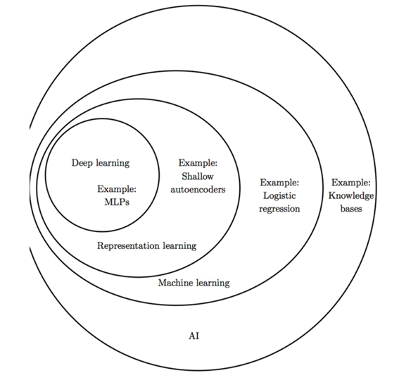

### 2. 关键历史里程碑与年代 (Key Milestones & Decades)

老师在录音中明确要求掌握重要模型提出的 **大致年代 (Which decades)**：

- 早期探索 (1940s-1960s)：
  - 1943年：**神经网络 (Neural Nets)** 概念提出 (McCulloch & Pitt)。
  - 1958年：**感知机 (Perceptron)** 提出 (Rosenblatt)。
- 第一个低谷期 (Dark Era / Fail)：
  - **1969年**：Minsky & Papert 指出感知机无法解决 **XOR 问题（非线性可分问题） (XOR problem / Non-linearly separable)**，导致神经网络研究进入多年停滞。
- 第二次浪潮与初步应用 (1980s-1990s)：
  - 1986年：**多层感知机 (Multilayer Perceptron, MLP)** 及 **反向传播 (Backpropagation)** 流行。
  - **20世纪90年代初 (Early 1990s)**：LeCun 提出 **LeNet**，成功应用于手写数字识别。
  - 1997年：**LSTM** 提出，解决了序列建模中的长程依赖问题。
- 深度学习爆发期 (2012年以后)：
  - **2012年**：**AlexNet** 在 ImageNet 大赛中取得突破，标志着深度学习开始爆发增长。
  - 2014年：**生成对抗网络 (GANs)** 提出。

### 3. 深度学习复兴的三大要素 (Why Deep Learning Now?)

考试可能会考查为什么深度学习在 2012 年后突然成功，主要源于“饥饿的算法”对资源的需求：

- **大数据 (Big Data Hungry)**：模型性能随数据量增加而显著提升。
- **计算资源 (Resources Hungry)**：特别是 **通用 GPU (General purpose GPUs)** 的出现，使得训练大型网络成为可能。
- **模型容量 (Capacity)**：更多的计算资源允许增加 **神经元数量 (Number of neurons)**，从而提升模型拟合复杂函数的能力。

### 4. 核心考点辨析 (Key Concept Distinctions)

- **机器学习 vs 深度学习**：传统机器学习依赖 **人工特征提取 (Feature extraction)**，而深度学习通过 **多层抽象 (Additional layers of more abstract features)** 同时学习特征表示和分类。
- **万能近似定理 (Universal approximation theorem)**：理论上，只要有足够的单元，**单隐层 (Single hidden layer)** 就能近似任何连续函数，但深层网络在参数效率上更高。

------

**学习类比**： 深度学习的历史就像是**从制作简单的手工工具到建造复杂的自动化工厂**。**感知机**是最初的单手工具，只能干简单的活（线性分类）；**XOR 问题**是挡在路上的巨石，让人们一度认为工具没用；而 **AlexNet** 的成功则像是发现了**电力（GPU）和原材料（大数据）**，让我们可以建造多层的**自动化生产线（深度网络）**，从此不再需要人力手动加工零件（人工特征工程）。

## L2

线性代数相关知识

## L3

根据课程课件（`l3-Lesson 3(2).pdf`, `l4-Lesson 4`）、期末总结录音及复习要点，以下是 **L3 深度网络与反向传播 (Deep Networks & Backpropagation)** 的考试要点总结：

### 1. 机器学习基础 (Machine Learning Basics)

- **学习的定义 (Definition of Learning)**：如果一个程序在任务 **T** 上的性能衡量指标 **P** 随着经验 **E** 的增加而提高，则称该程序在学习。
- 线性回归示例 (Linear Regression Example)：
  - **性能指标 (Performance Measure P)**：通常使用 **均方误差 (Mean Squared Error, MSE)**。
  - **训练误差 (Training error)**：在训练集上计算出的损失。
  - **测试误差 (Test error)**：在测试集上计算出的损失。
  - **Generalization error/loss:** the gab between  the  training error and test error. (Note that it  **only makes sense only when the training  error is small**. There is no need to talk  about GE when the training error is large)

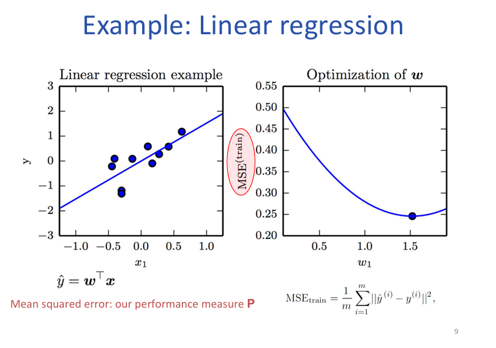

* **Underfitting and Overfitting**

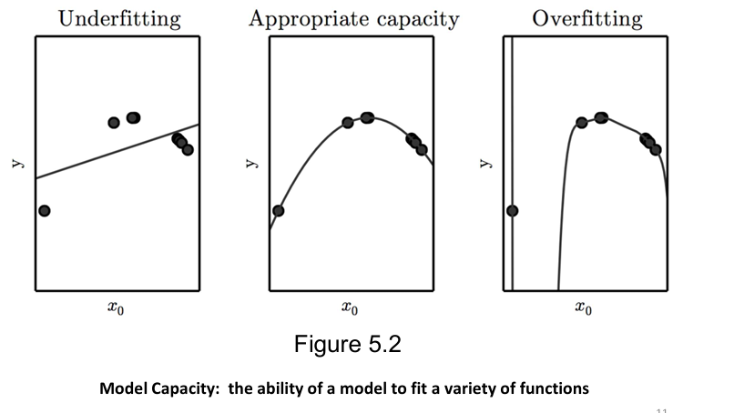

* **Generalisation and capacity**

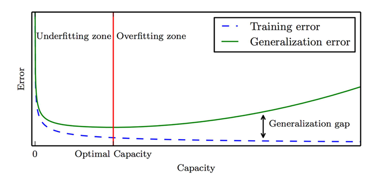

### 2. 深度神经网络的核心组件 (Ingredients of Deep Networks)

- 代价函数 (Cost Functions)：

- 通常使用 **负对数似然 (Negative log-likelihood)**，即训练数据与模型分布之间的交叉熵 (Cross-entropy)。

  - **Log 的作用**：可以抵消输出层中指数函数导致的 **饱和 (Saturate)** 现象，避免梯度过小。

  

- 输出单元 (Output Units)：

  - **⭐Sigmoid**：用于二进制变量，输出范围在**[0,1]之间**的概率。
    $$
    \sigma=\frac{1}{1+e^{-x}} \\
    \tilde{y} = \sigma(wx+b) \\
    \text{Gradient:} \frac{\partial\tilde{y}}{\partial x} = \sigma(x)(1-\sigma(x))
    $$

  

  - **⭐Softmax**：用于多分类问题，输出 **C** 个类别的概率分布。

  $$
  \tilde{y_i} = \text{softmax}(x)_i = \frac{exp(x_i)}{\sum_j exp(x_j)}
  $$

- 隐层单元 (Hidden Units)：

  - **⭐ReLU **：**最受欢迎的选择**。梯度计算快且强，但要注意神经元可能“死亡”。

  $$
  a = h(x) = max(x,0)\\
  \text{Gradient:} \frac{\partial a}{\partial x} =
  \begin{cases}
  0 & \text{if }x\leq 0 \\
  1 &\text{if } x>0
  \end{cases}
  $$

  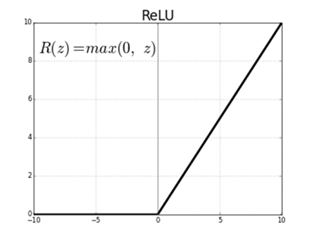

  - **Sigmoid 和 tanh**：在 ReLU 流行前常用，但容易 **饱和 (Saturate)** 导致梯度消失。其中 tanh 作为隐层单元通常优于 Sigmoid。

    - Sigmoid 的输出范围是 (0,1)，均值约为 0.5，会让后续神经元的输入自带 “偏置偏移”—— 相当于每个输入都额外加了一个常数，这会导致梯度更新的方向容易混乱，减慢模型收敛速度

  - **⭐tanh**激活函数
    $$
    a = tanh(x) = \frac{e^x - e^{-x}}{e^x+e^{-x}}\\
    \text{⭐Gradient: } \frac{\partial a}{\partial x} = 1-tanh^2(x)
    $$
    

### 3. ⭐ 反向传播与链式法则 (Backpropagation & Chain Rule)

**这是本章最重要的考点，录音中明确提到开放题必考手算题**。

- 核心机制：基于微积分的 **链式法则 (Chain Rule)**。
  $$
  \text{Chian Rule: } \frac{dz}{dx} = \frac{dz}{dy}\cdot\frac{dy}{dx}
  $$

  - **上游梯度 (Upstream gradient)** × **局部梯度 (Local gradient)** = 传回前一层的梯度。

  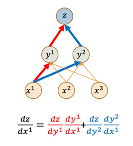

  * $\frac{\partial z}{\partial x_i} = \sum_j \frac{\partial z}{\partial y_j}\cdot  \frac{\partial y_j}{\partial x_i}$

- 必考题型 (Exam Question Pattern)：

  - 老师会给出一个简单的 **多层感知机 (MLP)** 结构，定义好输入输出、权重连接、激活函数（如 ReLU, Sigmoid, tanh）和损失函数（如 MSE, Cross-entropy）。
  - 要求：**手动计算 (Manually compute)** 在 1-2 次迭代后的 **权重更新值 (Weight updates)**。
  - 公式：$w^{(t+1)} = w^{(t)} - \eta_t \nabla_{w^{(t)}} L$。

- **雅可比矩阵 (Jacobian Matrix)**：在向量化表示中，局部导数表现为雅可比矩阵。

反向传播的计算去看吴恩达深度学习来复习

### 4. 架构设计与训练流程 (Architecture & Training Flow)

- **前向传播 (Forward Propagation)**：数据输入模型并产生预测值的过程。
- **反向传播 (Backpropagation)**：计算损失函数对参数梯度的过程。
- **深度 (Depth)** 与 **宽度 (Width)**：深度指层的数量，宽度指每层单元的数量。
- **正则化影响**：考试中可能会要求在反向传播计算时考虑 **正则化项 (Regularization)**（如 L1/L2）对梯度计算的影响。

------

**考试必备提示**：

1. **带计算器 (Bring a calculator)**：录音中特别强调，手算 BP 必须使用计算器，禁止使用手机。
2. 理解梯度流 (Patterns in Gradient Flow) (在L4详细讲)：
   - **加法门 (Add gate)**：梯度分配器 (Gradient distributor)。
   - **Max 门 (Max gate)**：梯度路由 (Gradient router)。
   - **乘法门 (Mul gate)**：梯度交换器 (Gradient switcher)。

**学习类比**： **反向传播**就像是在玩“**传声筒游戏**”，但是传回的是“报错信息”。最后一层的 **Loss** 发现错了，就通过 **链式法则** 把这个错误按比例分摊给前面的每一层，告诉每一个神经元：“你刚才贡献了多少偏差，现在就得往反方向修多少。”

## L4

⭐考前复习的时候记得手撕一遍计算图和MLP的梯度更新

### 1. 反向传播的目标与公式 (Goal & Formula)

- **核心目标 (Goal)**：计算损失函数对参数的梯度（Gradient of the loss w.r.t. parameters），以便执行梯度下降。

- **⭐权重更新公式 (Weight Update)**：
  $$
  w^{(t+1)} = w^{(t)} - \eta_t \nabla_{w^{(t)}} L \\
  \nabla_{w^{(t)}} \text{ :Gradient of loss w.r.t. parameters}\\
  \eta_t \text{ :Learning rate}
  $$

### 2. 链式法则与雅可比矩阵 (Chain Rule & Jacobian)

- **链式法则 (Chain Rule)**：对于第 $l$ 层参数，梯度通过各层导数相乘得到：

$$
\frac{\partial L}{\partial w^l} = \frac{\partial L}{\partial a^L} \frac{\partial a^L}{\partial a^{L-1}} \dots \frac{\partial a^l}{\partial w^l}
$$

- **雅可比矩阵 (Jacobian Matrix)**：局部梯度（Local gradient）通常表现为雅可比矩阵，即层输出对层参数的偏导。
- **层间依赖**：第 $l$ 层的梯度依赖于第 $l+1$ 层的误差信号传导。

### 3. 前向与后向算法 (Forward & Back Algorithm)

- 步骤 (Steps)：

  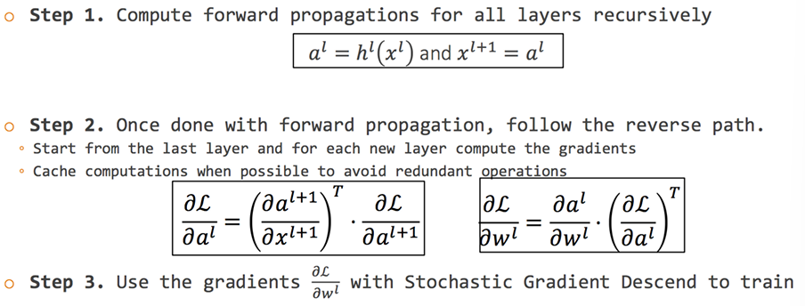

- 图示

  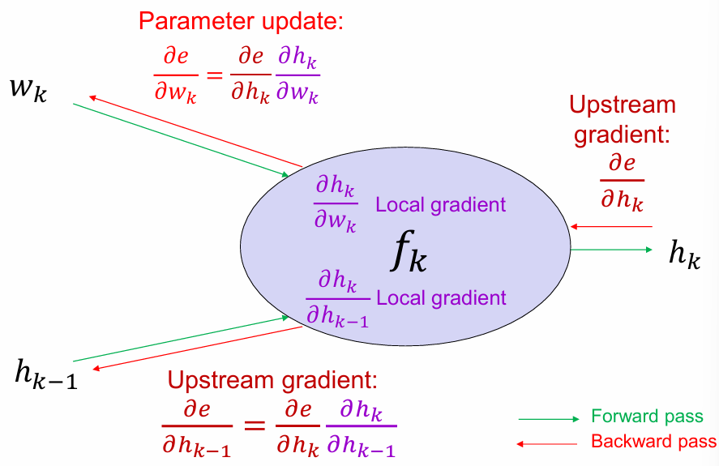

### 4. 隐藏层与非线性 (Hidden Layers & Nonlinearity)

- **非线性动机**：隐藏层必须跟随**非线性函数 (Nonlinearity)**，否则多层线性组合仍为线性，无法解决非线性可分问题（如 XOR）。
- **常见激活函数 (Common Nonlinearities)**：**Sigmoid**、**ReLU**（最常用）、**tanh**。
- **万能近似定理 (Universal Approximation Theorem)**：只要隐藏单元足够多，单隐层即可近似任何连续函数。

### 5. 计算图与手动梯度推导 (Computation Graph & Manual Derivation)

- **计算图 (Computation Graph)**：将网络视为输入到输出的转换链，包含隐藏表示（Hidden representation）和损失函数（Loss function）。
  - 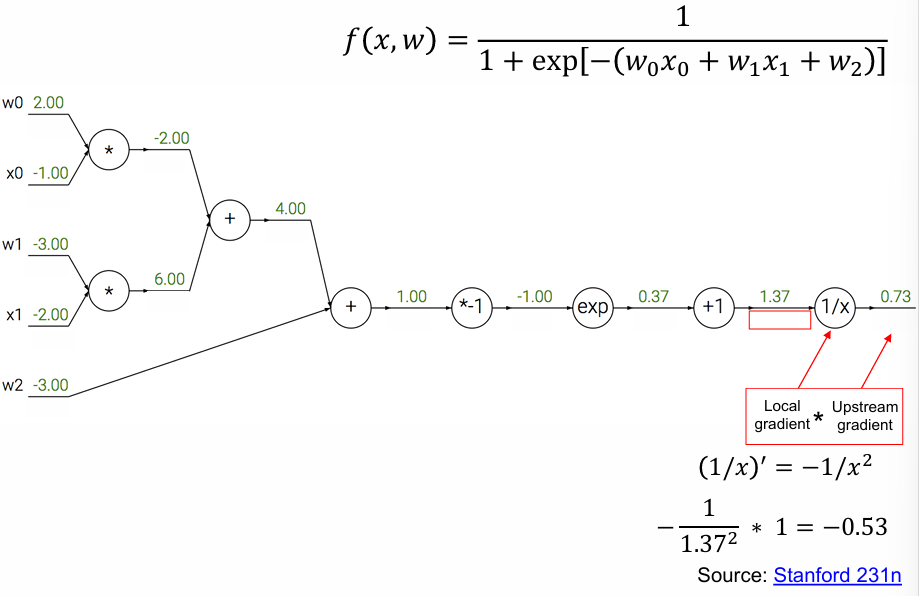
  - 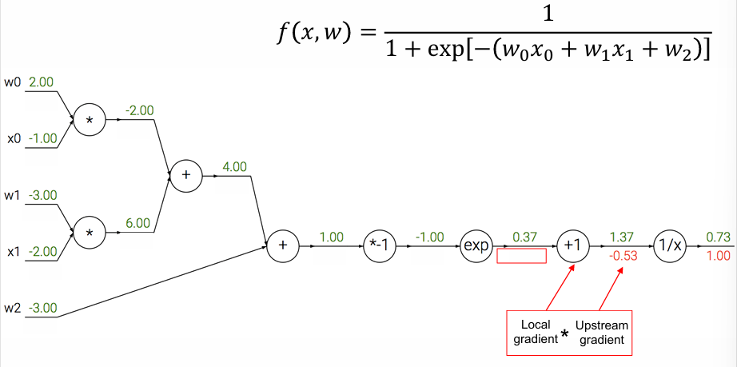
  - 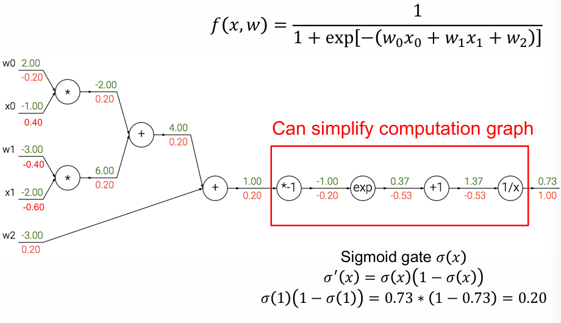
- **⭐ 必考：手撕反向传播**：录音强调会给定一个简单的 MLP 结构，要求手动计算一次迭代后的权重更新。
- 局部梯度 vs 上游梯度 (Local vs Upstream Gradient)：
  - **上游梯度**：来自后一层的误差信号 $\frac{\partial e}{\partial h_k}$。
  - **局部梯度**：当前层自身的导数 $\frac{\partial h_k}{\partial w_k}$。

### 6. 梯度流模式 (Patterns in Gradient Flow)

- **分支求和 (Gradients add at branches)**：如果一个输入通向多个分支，其梯度在分支处相加。

- 门控特征 (Gate Patterns)：

  - **加法门 (Add gate)**：梯度分配器（Gradient distributor）。
  - **Max 门 (Max gate)**：梯度路由（Gradient router），只将梯度传给最大值路径。
  - **乘法门 (Mul gate)**：梯度交换器（Gradient switcher）。

  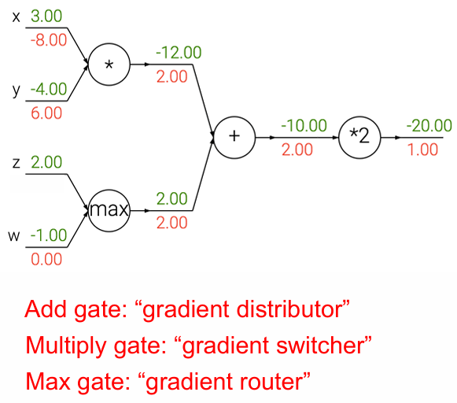

- **Sigmoid 导数技巧**：$\sigma'(x) = \sigma(x)(1 - \sigma(x))$。

------

**考试特别提醒**：

1. **维度分析 (Dimension analysis)**：在推导矩阵梯度公式时，必须确保矩阵维度匹配。
2. **计算器**：录音明确提到“手动计算 BP 需要带计算器”。

# L5

根据课程课件（`l5-Lesson 5_full.pdf`）及期末总结录音，以下是 **L4/L5 优化与正则化 (Optimization & Regularization)** 的考试要点总结，按 PPT 知识点出现的先后顺序排列：

### 1. 梯度下降变体 (Gradient Descent Variants)

- **批量梯度下降 (Batch Gradient Descent, BGD)**：在整个训练集上计算梯度。
  - 优点：
    - 可以使用基于二阶导数（second order  derivatives (Hessian)）的加速技术
    - Can measure not only the gradient but also  the curvature of the loss function
    - It’s possible to do a simple theoretical analysis of  the convergence rate
  - 缺点：
    - Datasets can be **too large** for a complete gradient computation to be feasible
    - Loss surfaces are highly **non-convex** and **high dimensional**
  - ⭐公式：

$$
\nabla_{w(t)}L = \frac{1}{m}\sum^m_{i=1}\nabla_{w^{(t)}}L(w;x_i,y_i) \\
\text{m training samples } (x_i,y_i)
$$

- **Stochastic gradient descent（SGD）**

  > An alternative is to compute the gradient and use  it to update the weights as we input the training  samples **one by one**
  >
  > SGD 每次仅选取**一个样本**来计算梯度并更新权重

  - 优点：
    - **速度快**：无需等待所有数据处理完，从第一个样本就开始改进模型。
    - **防止过拟合 (Avoid Overfitting)**：引入的随机性（噪声）能帮助模型跳出局部最优
    - **适应性**：适合处理随时间动态变化的数据集。
  - 缺点：
    - **并行性差**：单个样本的计算无法充分利用 GPU 的并行加速能力。
    - **收敛不稳定**：梯度估计具有不确定性。
  - 公式：

  $$
  w^{(t+1)}=w^{t}- \eta_t \nabla_{w^{(t)}} L(w;x_i,y_i)
  $$

  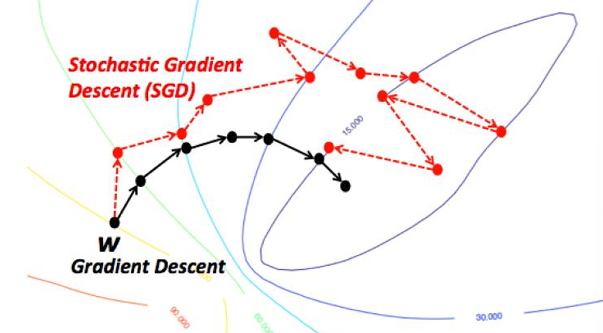

- **Mini-batch gradient descent**

  > 不同于在整个训练集上计算梯度的 Batch GD，SGD 每次仅选取**一个样本**来计算梯度并更新权重

  * **折中方案**：使用一小组数据样本 *B* 计算梯度，既能利用并行计算，又保持了 SGD 的灵活性。

  * More general version of stochastic gradient  descent (so often called SGD)。在深度学习实践中提到的“SGD”通常指的就是 Mini-batch GD

  * 公式：
    $$
    w^{t+1} = w^{t}- \frac{\eta_t}{|B|}\sum_{b\in B} \nabla_{w^{(t)}} L(w;b)
    $$

- **优化算法动机**：掌握 **Adam**（自适应动量）结合了一阶动量（Momentum）和二阶信息（AdaGrad/RMSProp）的原理。

### 2. 优化中的挑战 (Challenges in Optimization)

考试需识别影响模型收敛的几种地形特征：

- **病态调节 (Ill-conditioning)**：涉及 Hessian 矩阵的特征值问题。
- **局部最小值 (Local minima)**：模型停留在局部误差最小处，而非全局最优。
- **高原、鞍点及平坦区域 (Plateaus, saddle points, and other flat regions)**。
- **悬崖与梯度爆炸 (Cliffs and exploding gradients)**：梯度突然激增，通常需要梯度裁剪（Clipping）。

### **3. 动量算法 (Momentum) - 一阶信息**

* **动量 (Momentum)**：引入速度参数 *v* 累积历史梯度，利用物理动量原理**抑制振荡 (Dampens oscillations)**，实现更快收敛。

* **Nesterov 动量 (Nesterov Momentum)**：利用“未来”梯度信息 (use the future gradient)，比标准动量收敛效果更好。

### **4. 自适应学习率 (Adaptive Learning Rates)**

* **二阶信息**

  * **Delta-bar-delta**：早期的启发式方法，根据梯度符号是否变化来增减学习率，仅适用于 Batch GD。

  * **AdaGrad**：根据历史梯度平方和的平方根缩放学习率。**缺点**：历史记录过长会导致梯度更新过早停止。

  * **RMSProp**：AdaGrad 的改进版，使用**指数移动平均 (Exponential moving average)** 累积梯度，更适合深度学习中的非凸优化。

* **⭐ Adam (Adaptive Momentum)**：结合了**一阶动量 (Momentum)** 和**二阶信息 (RMSProp)**，对超参数选择非常鲁棒。

### **5. 二阶优化 (Second Order Optimisation)**

* **牛顿法 (Newton’s method)**：利用 Hessian 矩阵的二阶导数信息（曲率）寻找最优路径。

* **劣势**：Hessian 矩阵求逆的计算复杂度极高 (*O*(*k*3)，其中 *k* 为参数量)，且在曲率过大时不稳定。

### 6. 正则化 (Regularization)

- **核心动机**：防止 **过拟合 (Overfitting)** 并控制 **模型容量 (Model Capacity)**。

- ⭐**L1 正则化**：强制产生 **稀疏权重 (Sparse weights)**，起到 **特征选择 (Feature selection)** 的作用。
  $$
  w^* =argmin[\sum_{x,y}L(w_1,\dots,L;x,y)+\lambda \sum_{l}|w_l|]\\
  \text{w*是一个参数集合—当用它代入后面的函数时，这个整体函数的取值会达到最小值。 } \\
  \text{代入时，是把函数中所有的\(w_i\)，替换成\(w^*\)里对应的最优分量\(w_i^*\)}\\
  w_l = w_l - \lambda_{\eta}\frac{w_l}{|w_l|}-\eta \nabla_w L
  $$

- ⭐**L2 正则化 (Weight Decay)**：**最常用**，驱动权重趋向原点（使权重更小），其更新公式包含权重衰减项：$w_l = (1 - \lambda\eta)w_l - \eta \nabla_{w_l} L$。
  $$
  w^* =argmin[\sum_{x,y}L(w_1,\dots,L;x,y)+\frac{\lambda}{2} \sum_{l}||w_l||^2_2]\\
  ||w_l||_2\text{ 是L2范数}\\
  ||w_l||_2 = \sqrt{w_{l1}^2 + w_{l2}^2 + ... + w_{lk}^2}
  $$

- **数据集增强 (Dataset augmentation)**：通过变换数据模拟真实场景

- **早停 (Early stopping)**：当验证集误差上升时停止训练

- **⭐ Dropout**：训练时以**概率p**随机关闭神经元，**测试时需使用全部神经元并加权（激活值乘以概率 p）**。

  > Dropout在测试时“用全部神经元+激活值乘概率p”，核心是为了**对齐训练与测试阶段的输出期望**，避免预测结果偏差，具体逻辑是：
  >
  > 1. 训练阶段的Dropout机制 训练时，每个神经元有概率\( p \)被**保留（不关闭）**，概率\( 1-p \)被关闭。此时，单个神经元的输出是： $ \text{输出}_\text{训练} = \text{激活值} \times \mathbb{I}(\text{神经元被保留}) $ $( \mathbb{I} $是指示函数：保留则为1，关闭则为0）此时，该神经元的**输出期望**是： $ \mathbb{E}[\text{输出}_\text{训练}] = \text{激活值} \times p $ （因为$ \mathbb{I} $的期望是\( p \)）  
  >
  > 2. 测试阶段的问题（若不用加权） 如果测试时也随机关闭神经元：
  >
  >    - 预测结果会**不稳定**（每次关闭的神经元不同，输出不同）； 
  >    - 若直接用“全部神经元不关闭”：单个神经元的输出期望会变成$ \text{激活值} \times 1 $，远大于训练时的期望$ \text{激活值} \times p $，导致模型输出整体偏大，预测结果失真。 
  >
  > 3. “全部神经元+乘p”的作用测试时使用**全部神经元**（保证预测稳定），同时将每个神经元的激活值**乘以\( p \)**，相当于把输出期望拉回训练时的水平： $ \mathbb{E}[\text{输出}_\text{测试}] = \text{激活值} \times p $ 这样训练与测试阶段的输出期望一致，模型的预测结果才会准确。  
  >
  >    简单说：训练时神经元“随机打折（概率p保留）”，测试时就得给所有神经元“统一打折（乘p）”，才能让模型的输出规律和训练时保持一致

### **7. 初始化与预处理 (Common Practices)**

* **权重初始化 (Weight initialisation)**：必须打破**权重对称性 (Weight asymmetricity)**。常用方法包括 **Xavier 初始化**（适用于 tanh/sigmoid）和 **Relu(He)初始化**（适用于 ReLU）。

  * **Why weight asymmetricity is bad?**

    >  Because if 2 units share the same  activation, same weights, and same inputs, they  will be updated in the same way (no learning)

  * **Xavier 初始化**

    

  * **ReLU初始化**

    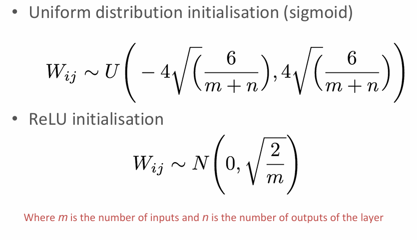

* **数据预处理 (Data pre-processing)**：数据应**中心化 (Zero-centered)** 且进行**单位规范化 (Unit normalisation)**，以避免单元饱和(saturation)导致的梯度消失(vanishing gradients)。

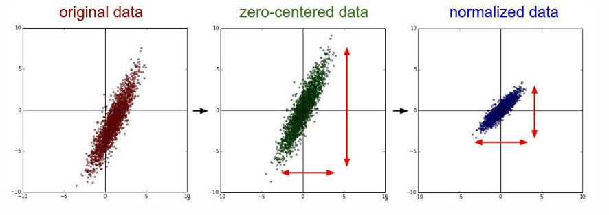

### **8. ⭐ 批规范化 (Batch Normalisation, BN)**

> **Two important principles** :The distribution of the data fed to the layers of a network should be: 
>
> *  zero-centred (done in **Data pre-processing** )
> * constant through time and data (mini-batches) 
>   - Normalize the activations of each layer!

* **原理**：在层间规范化激活值，保持零中心且分布在 mini-batches 间恒定。Z代表该层的线性输出

$$
\text{课本原始公式（X为输入，W为当前层权重）:}\\
Z =XW\\
\tilde Z = Z -\frac{1}{m}\sum_{i=1}^m Z_i \\
\hat{Z} = \frac{\tilde Z}{\sqrt{\epsilon} + \frac{1}{m}\sum_{i=1}^{m}\tilde{Z}_i^2}\\
H = max\{0,\gamma \hat Z +\beta\}\\
$$

* **推导**

$$
Z =XW\\
\text{step1-计算均值: }\mu_B=\frac{1}{m}\sum_{i=1}^m Z_i\\
\text{step2-计算方差: }\sigma^2_B=\frac{1}{m}\sum_{i=1}^{m}(Z_i-\mu_B)^2 \\
\text{step3-规范化: }\hat{Z} = \frac{Z-\mu_B}{\sqrt{\sigma^2_B+\epsilon}}\\
\text{step4-仿射变换+激活函数: }H = max\{0,\gamma \hat Z +\beta\}
$$

• **考试要点**：

1. **目的**：加速训练，减少内部协变量偏移。

2. **参数**：包含可训练参数（*γ*,*β*）和超参数。
   * **可训练参数 (Trainable parameters)**：
   
     * *γ* **(缩放/Scale)**：用于对规范化后的值进行缩放。
     *  *β* **(偏移/Offset or Shift)**：用于对规范化后的值进行平移。
   * **超参数 (Hyperparameters)**：
       * *ϵ*：在分母中添加的小常数，用于保证数值稳定性（防止除以零）。
       * **动量 (Momentum)**：用于计算全局均值和方差的衰减率。
   
3. **测试应用**：测试集必须使用**训练时统计的全局均值和方差**。

------

### ⭐包含L1/L2正则化的BP

**考试计算预警**： 录音提到，在反向传播（BP）的手算题中，可能会要求你计算包含 **L1/L2 正则化项** 后的权重更新值。

在反向传播（BP）的手算题中，加入正则化意味着你在计算总损失函数 $L$ 的梯度时，需要同时考虑**数据损失（Data Loss）和正则化项（Regularization term）**。

以下是具体的计算方法和步骤：

**1. 计算核心公式**

正则化的目标是减少模型容量以防止过拟合。总梯度的计算公式为： $$\nabla_w L_{total} = \nabla_w L_{data} + \lambda \nabla_w \Omega(w)$$

- L1 正则化 (L1 Regularization)：
  - 项：$\lambda \sum |w_l|$。
  - 梯度：$\lambda \cdot \text{sign}(w)$（即 $w>0$ 时为 $+1$，$w<0$ 时为 $-1$）。
  - 更新公式：$w^{(t+1)} = w^{(t)} - \eta (\nabla_w L_{data} + \lambda \cdot \text{sign}(w^{(t)}))$。
- L2 正则化 (L2 Regularization / Weight Decay)：
  - 项：$\frac{\lambda}{2} \sum w_l^2$。
  - 梯度：$\lambda w$。
  - 更新公式：$w^{(t+1)} = (1 - \lambda\eta)w^{(t)} - \eta \nabla_w L_{data}$。

**2. 手算示例 (Manual Example)**

假设你在考试中遇到以下参数：

- 当前权重 $w = 0.5$
- 学习率 $\eta = 0.1$
- 正则化系数 $\lambda = 0.1$
- 通过链式法则算出数据损失的梯度 $\nabla_w L_{data} = 0.2$

​	**计算 L1 更新值：**

1. 计算正则化梯度：$\lambda \cdot \text{sign}(0.5) = 0.1 \times 1 = 0.1$。
2. 总梯度：$0.2 + 0.1 = 0.3$。
3. 更新权重：$w_{new} = 0.5 - 0.1 \times 0.3 = \mathbf{0.47}$。

​	**计算 L2 更新值：**

1. 计算权重衰减系数：$(1 - \lambda\eta) = (1 - 0.1 \times 0.1) = 0.99$。
2. 更新权重：$w_{new} = 0.99 \times 0.5 - 0.1 \times 0.2 = 0.495 - 0.02 = \mathbf{0.475}$。

**3. 考试注意事项**

- **符号判定**：L1 正则化在计算时必须注意权重 $w$ 的正负号（$\text{sign}$ 函数）。
- **权重衰减**：在 L2 更新中，记住 $(1 - \lambda\eta)$ 这一项会直接让权重向原点缩减。
- **计算器**：录音强调务必使用计算器，以确保这些小数位乘法的准确性。

### ⭐完整的 **2层多层感知机（MLP）** 手算题

这是一个完整的 2 层 MLP 手算练习题，结合了前向传播、反向传播以及 **L1/L2 正则化** 的更新逻辑。

**1. 题目设置 (Setup)**

- **网络结构**：1 个输入单元 ($x$) $\rightarrow$ 1 个隐层单元 ($a_1$) $\rightarrow$ 1 个输出单元 ($\hat{y}$)。
- 已知条件：
  - 输入 $x = 1.0$，标签 $y = 0.0$。
  - 初始权重：$w_1 = 0.5$ (输入到隐层)，$w_2 = -0.4$ (隐层到输出层)。
  - 激活函数：隐层使用 **Sigmoid** ($\sigma(z) = \frac{1}{1+e^{-z}}$，导数 $\sigma' = \sigma(1-\sigma)$)。
  - 损失函数：**MSE** ($L = \frac{1}{2}(\hat{y}-y)^2$)。
  - 超参数：学习率 $\eta = 0.1$，正则化系数 $\lambda = 0.1$。

------

**2. 前向传播 (Forward Pass)**

1. 隐层输入/输出：
   - $z_1 = w_1 \cdot x = 0.5 \cdot 1.0 = 0.5$
   - $a_1 = \sigma(0.5) = \frac{1}{1+e^{-0.5}} \approx \mathbf{0.622}$
2. 预测值：
   - $\hat{y} = w_2 \cdot a_1 = -0.4 \cdot 0.622 = \mathbf{-0.249}$

------

**3. 反向传播：计算数据梯度 ($\nabla L_{data}$)**

我们需要先算出不含正则化的原始梯度：

1. **输出层误差信号**：$\delta_{out} = \frac{\partial L}{\partial \hat{y}} = (\hat{y} - y) = -0.249 - 0 = \mathbf{-0.249}$

2. **$w_2$ 的数据梯度**：$\nabla_{w_2} L_{data} = \delta_{out} \cdot a_1 = -0.249 \cdot 0.622 \approx \mathbf{-0.155}$

3. $w_1$ 的数据梯度

   ：使用链式法则

   - $\nabla_{w_1} L_{data} = \delta_{out} \cdot w_2 \cdot \sigma'(z_1) \cdot x$
   - $\sigma'(0.5) = 0.622 \cdot (1 - 0.622) \approx 0.235$
   - $\nabla_{w_1} L_{data} = -0.249 \cdot (-0.4) \cdot 0.235 \cdot 1.0 \approx \mathbf{0.023}$

------

**4. 权重更新：加入正则化**

* **场景 A：对 $w_2$ 应用 L2 正则化 (Weight Decay)**

根据公式 $w_{new} = (1 - \lambda\eta)w - \eta \nabla L_{data}$：

1. **衰减系数**：$(1 - 0.1 \cdot 0.1) = 0.99$
2. **更新**：$w_{2, new} = 0.99 \cdot (-0.4) - 0.1 \cdot (-0.155)$
3. **结果**：$-0.396 + 0.0155 = \mathbf{-0.3805}$

* **场景 B：对 $w_1$ 应用 L1 正则化 (Sparsity)**

根据公式 $w_{new} = w - \eta (\nabla L_{data} + \lambda \cdot \text{sign}(w))$：

1. **正则化项梯度**：由于 $w_1=0.5 > 0$，则 $\lambda \cdot \text{sign}(0.5) = 0.1 \cdot 1 = 0.1$
2. **总梯度**：$0.023 + 0.1 = 0.123$
3. **更新**：$w_{1, new} = 0.5 - 0.1 \cdot 0.123$
4. **结果**：$0.5 - 0.0123 = \mathbf{0.4877}$

------

#### **复习要点总结**

- **L2 会让权重均匀变小**，通过 $(1-\lambda\eta)$ 直接缩放。
- **L1 会强制将权重推向 0**（产生稀疏性），更新时加减固定的 $\lambda$。
- **考试提醒**：手算时务必先算出 $\nabla L_{data}$，再根据题目要求的正则化类型代入更新公式。

## L6

根据 L6 课件 (`l6-Lesson_6_part_1` 与 `part_2`) 及期末复习资料，以下是按 PPT 顺序排列的考试要点总结：

### 1. 权重初始化 (Weight initialisation)

- **权重不对称性 (Weight asymmetricity)**：深度学习训练强烈依赖初始点，如果所有权重初始化为相同值（如 0），神经元将以相同方式更新，导致无法学习。
- 权重大小权衡 (Large vs Small weights)：
  - 大权重能打破对称性并传播强信号，但可能导致梯度爆炸 (Exploding values) 或单元饱和 (Saturation)。
  - 小权重会导致信号消失。
- **保持方差 (Maintain variance)**：理想情况下，层的输入和输出应保持相同的方差。
- **初始化方法**：
  -  **Xavier 初始化** (适用于 tanh) $W_{ij} \sim U(-\sqrt{(\frac{6}{m+n})},\sqrt{(\frac{6}{m+n})})$
  - **ReLU 初始化** $W_{ij} \sim N(0, \sqrt{2/m})$。

### 2. 数据预处理 (Data pre-processing)

- **零中心化 (Zero-centered)**：减去均值，使训练数据以零为中心，有助于避免饱和及梯度消失。
- **单位规范化 (Unit normalisation)**：将输入缩放到相似的协方差，防止不同维度的梯度差异过大导致更新困难。

### 3. 批规范化 (Batch normalisation, BN)

- **核心原则**：各层输入的数据分布应保持 **零中心 (Zero-centered)** 且在不同 **小批量 (Mini-batches)** 间保持恒定。
- **公式与参数**：$H = \max{0, \gamma\hat{Z} + \beta}$。其中 $\gamma$ (缩放) 和 $\beta$ (偏移) 是 **可训练参数 (Trainable parameters)**。
- **测试集处理 (BN on validation/test set)**：⭐ **重要考点**。在测试阶段，不计算当前批次的统计量，而是使用训练阶段累积得到的 **全局均值和方差**。

### 4. 卷积神经网络动机 (Motivations of CNN)

- MLP 的局限性：
  - **参数量巨大**：对于高清图像，仅 1 层隐藏层就可能产生 **6 亿个参数 (600 MILLION PARAMETERS)**。
  - **平移敏感性**：图像向右移动 1 像素就会导致 **输入向量的巨大变化 (BIG CHANGE OF INPUT VECTOR)**。
- **CNN 的解决方案**：通过卷积滤波器 **保留空间结构 (Preserve spatial structure)**。

### 5. CNN 核心特性 (Key idea of CNNs)

- **稀疏连接 (Sparse connectivity)**：由于卷积核尺寸小，输出单元仅与局部输入连接。
- **参数共享 (Parameter sharing)**：在所有空间位置共享同一组权重（卷积核），极大减少参数量。
- **优势总结**：相比 MLP，CNN 的核心优势在于 **权重共享与稀疏性 (Weights sharing & Sparsity)**。

### 6. 卷积计算

- **零填充 (Zero padding)**：用于 **控制尺寸 (Controls size)**。如果不使用填充，图像在卷积后会 **收缩 (Shrinks)**。

- **尺寸公式**：$h_{out} = \frac{h_{in} - h_f+2p}{s} + 1$。其中 $h_f$ 是核大小，$s$ 是步长 (Stride),$p$是填充尺寸。

- **深度**： $d_f =d_{in}$$d_{out} = n_f$

  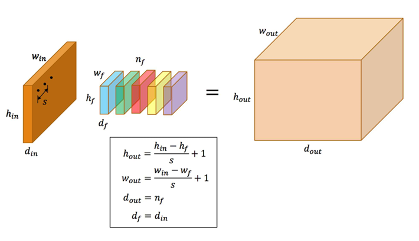

- **2D卷积计算**

  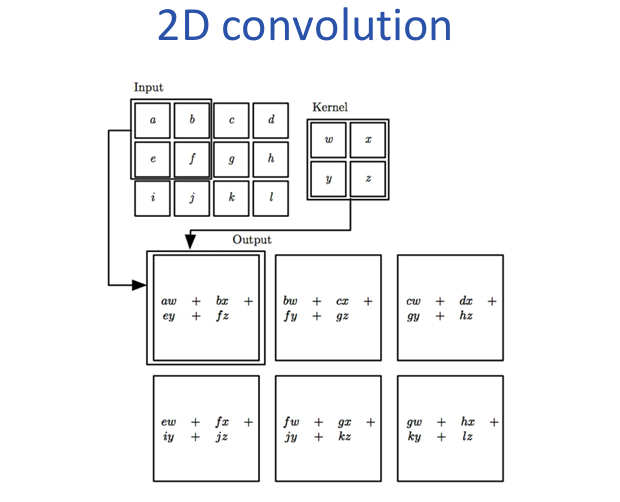

### 7. 池化层 (Pooling)

- **作用**：聚合多个值、减小层尺寸以加速计算、保留重要信息。

- **池化特性：变换不变性 (Invariance to small transformation)**：池化使网络对输入的微小位移或变换不敏感。

- **常用类型**：**最大池化 (Max pooling)** 和平均池化 (Average pooling)。

  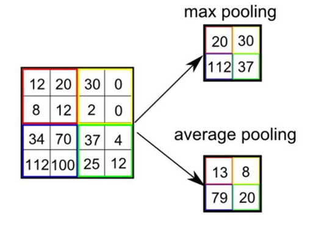

### 8. ⭐ 考试提醒

老师在录音中提到，CNN 的基础概念（如为什么需要卷积、卷积与 MLP 的区别）和 **Batch Norm 的参数细节** 是非常容易拿分的考点。

## L7

根据 L7 课件 (`l7-Lesson7_slides(3).pdf`) 及期末复习要点，这一章的核心是**经典 CNN 架构的演进及其设计原理**。以下是按 PPT 知识点先后顺序整理的考试要点：

### 1. 经典架构：LeNet-5 (1998)

- **地位**：CNN 的鼻祖 (The grandaddy of CNNs)，由 **LeCun 在 1998** 年提出，用于支票上的手写数字识别。
- **结构考点**：包含 7 层，输入为 32x32 图像。
- **层级顺序**：卷积层 (Convolution) $\rightarrow$ 平均池化 (Average Pooling) $\rightarrow$ 卷积 $\rightarrow$ 平均池化 $\rightarrow$ 卷积 $\rightarrow$ 全连接层 (FC) $\rightarrow$ 输出层 (Softmax)。
- **激活函数**：早期使用的是 **tanh** 而非 ReLU。
- **局限性**：受限于当时的计算能力，无法扩展到更大的图像。

### 2. AlexNet (2012) —— 深度学习的爆发点

- **里程碑意义**：在 2012 年 ImageNet 挑战赛 (ILSVRC) 中夺冠，将错误率从 26% 降低到 16.4%。
- 结构特性：
  - 包含 5 个卷积层和 3 个全连接层。
  - **参数量**：约 6000 万个参数 (Approximately 60 million parameters)。
  - **关键改进**：使用 **ReLU** 代替 tanh 加速训练，并引入 **Dropout** 防止过拟合。
  - **训练细节**：在两块 NVIDIA GTX 580 GPU 上同步训练。第一层学习了 96 个 11x11x3 的卷积核，这些核并非手工设计而是通过学习得到的 (Learned and not hardcoded)。

### 3. VGG16 (2014) —— 深度与小卷积核

- **核心理念**：结构简单但深度是关键 (Depth is the key)，拥有 16 个卷积层。
- **参数量**：约 1.38 亿个参数 (Approximately 138 million parameters)，比 AlexNet 更多。

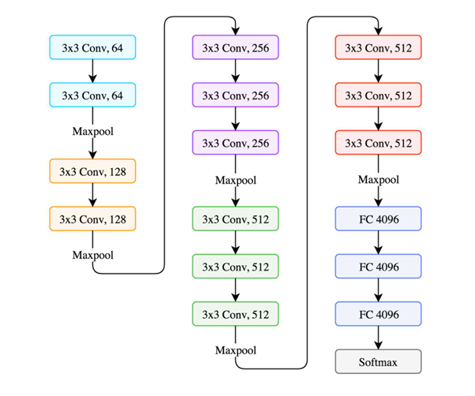

- 堆叠小卷积核 (Small filters)：

  - 大量使用 **3x3 卷积核**。
  - **重要结论**：**2 个堆叠的 3x3 卷积具有与 1 个 5x5 卷积相同的感受野 (Receptive field)**。

  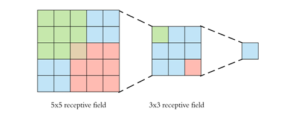

- 优点：

  1. 更多 ReLU 层产生更多非线性，使模型更强大。
  2. **更少的参数**：例如 3 个 3x3 (27个参数) 优于 1 个 7x7 (49个参数)。

### 4. GoogLeNet / Inception V1 (2014) —— 宽度与 1x1 卷积

- **核心组件：Inception 单元 (Inception unit)**。

- **设计动机**：解决深层网络易过拟合及大尺寸卷积计算昂贵的问题。

- **解决方案**：让网络变“宽”而非仅变深。在同一层并行操作多种尺寸的滤波器 (Filters of multiple sizes)。

  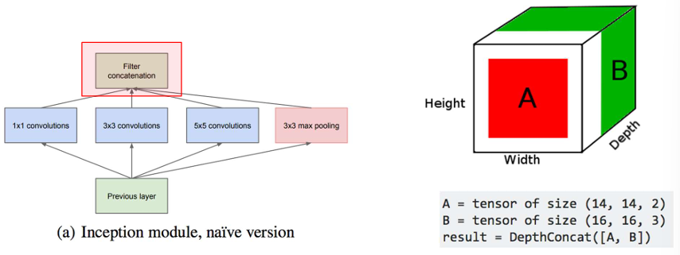

  > Use padding to make sure filter outputs have same size. Concatenate along depth

- **⭐ 1x1 卷积 (1x1 Convolutions)**：用于 **降维/减少通道数 (Dimension reductions)**，以控制计算成本。

  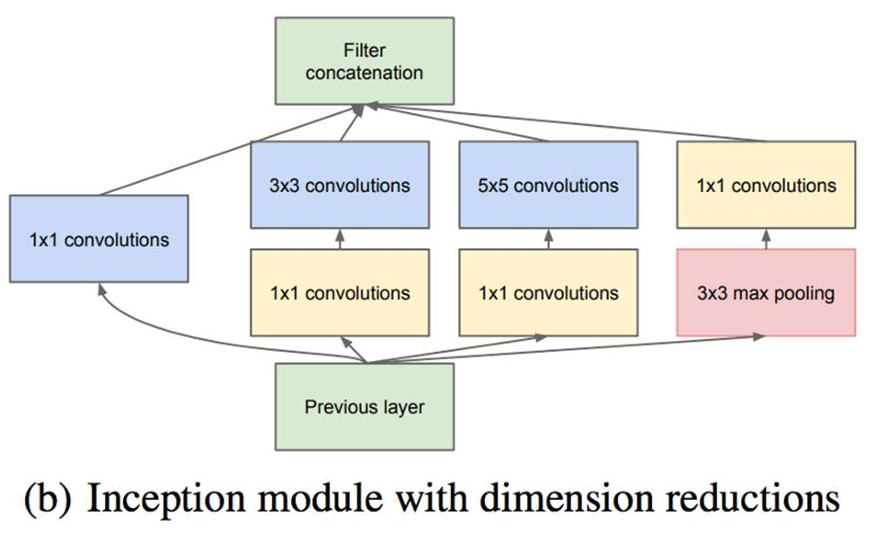

- **辅助损失 (Auxiliary loss)**：由于网络有 22 层，为解决 **梯度消失 (Vanishing gradient)** 问题，在中间层引入了中间分类器(intermediate classifiers)。

  `total_loss = real_loss +0.3 *aux_loss_1 +0.3*aux_loss_2`

- **Inception v1 (GoogLeNet)**：参数量约 **500 万**；核心是 Inception 单元，使用 **1x1 卷积** 进行降维，并包含辅助损失（auxiliary loss）

  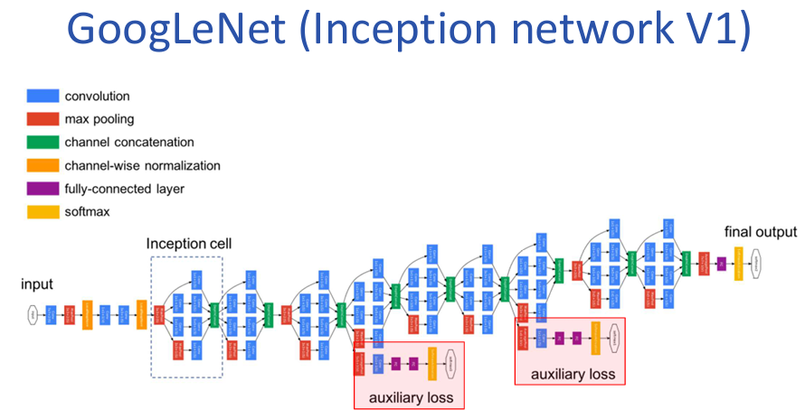

### **5.Inception v3**

参数量增加到约 **2300 万**；引入了 **滤波器分解（Factorise filters）**，例如将 *n*×*n* 分解为 1×*n* 和 *n*×1，并使用了 **Batch Normalization (BN)** 和 **RMSprop**

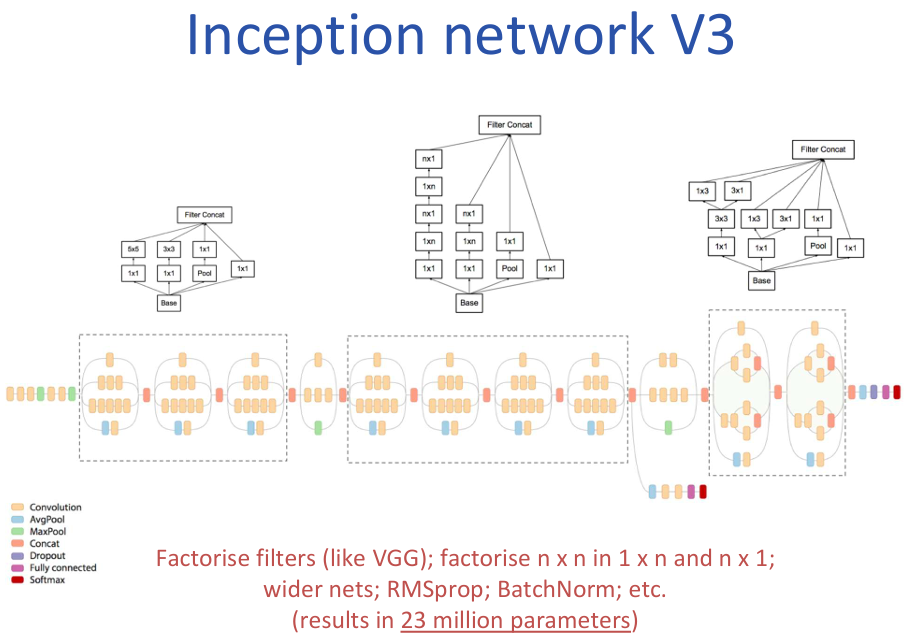

### 6. ResNet (2015) —— 残差学习与跳跃连接

- **残差模块 (Residual module)**：引入了 **跳跃连接 (Skip or shortcut connections)**。

  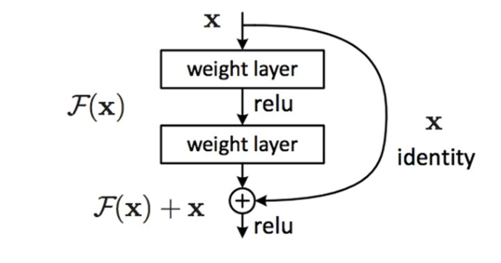

- **动机**：使网络层更容易学习到 **恒等映射 (Identity mapping)**，从而解决超深网络的退化问题。

- **瓶颈结构 (Bottleneck)**：使用 1x1 减少维度 $\rightarrow$ 3x3 卷积 $\rightarrow$ 1x1 恢复维度，极大减少了计算量。(注意：**卷积核的数量**直接决定了输出特征图的深度）

  **深度**：可达 152 层，是 2015 年 ILSVRC 冠军。

### 7. Inception v4

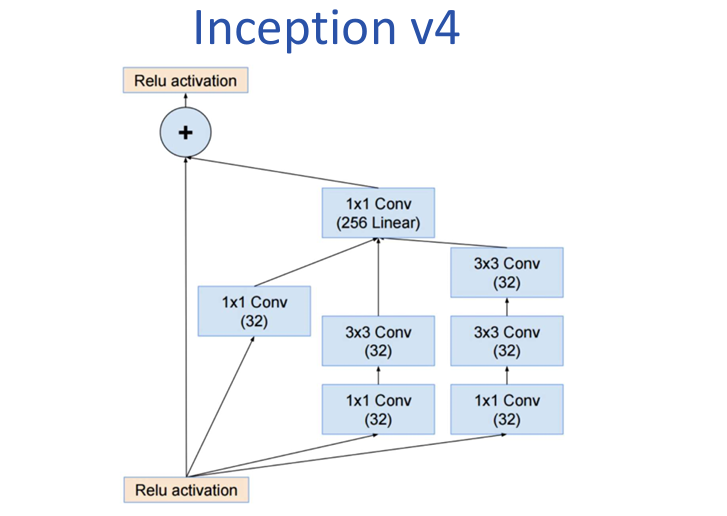

### 8. 其他变体 (Beyond ResNet)

- **ResNeXt**：引入 **基数 (Cardinality)** 概念，即分支路径的数量，认为增加基数比单纯增加深度或宽度更有效。
- **DenseNet**：层与层之间 **稠密连接 (Densely connected)**，实现更有效的特征复用。

  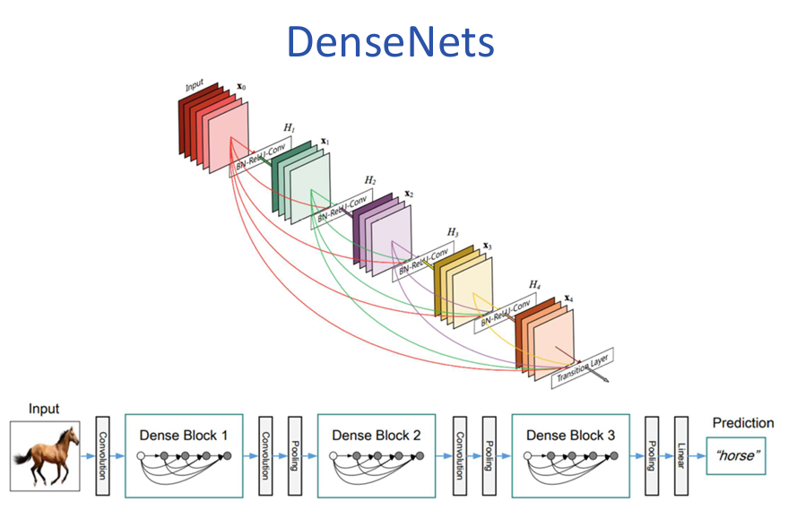

### 9. 迁移学习 (Transfer Learning)

- **核心操作**：利用训练好的网络处理新任务。

- 方法：

  1. 提取全连接层 (FC layer) 的激活向量作为**现成特征 (Off-the-shelf feature)**。
  2. 在 FC 层之上训练新的分类器。
  3. 对整个网络进行 **微调 (Fine-tune)**。

## L8

根据 L8 课件及期末复习要点，本章核心围绕 **循环神经网络 (RNN)** 及其改进模型 **LSTM** 展开。

### 1. RNN 动机与序列数据 (Learning over sequences)

- **序列数据**：许多数据自然以序列形式出现，如视频、文本、语音和气候测量数据。
- **时间依赖性 (Temporal dependencies)**：与图像不同，序列数据必须考虑结构（通常是时间依赖性），且过去与未来的处理并不总是对称的。
- **变长输入 (Arbitrary length)**：RNN 可以处理非常长的依赖关系以及任意长度的输入/输出。

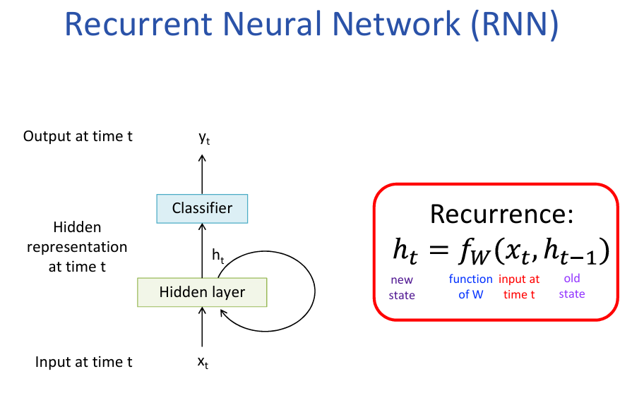

### 2. 基础 RNN 结构与原理 (Vanilla RNN)

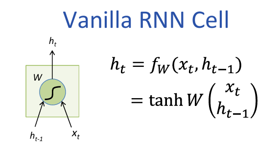

- **定义**：连接形成沿时间序列的有向图，允许其表现出时间动态行为。

- **展开 RNN (Unrolling/Unfolded RNN)**：在计算前向和后向传播时，将 RNN 展开视为一个接受整个时间序列作为输入的大型前馈网络。

  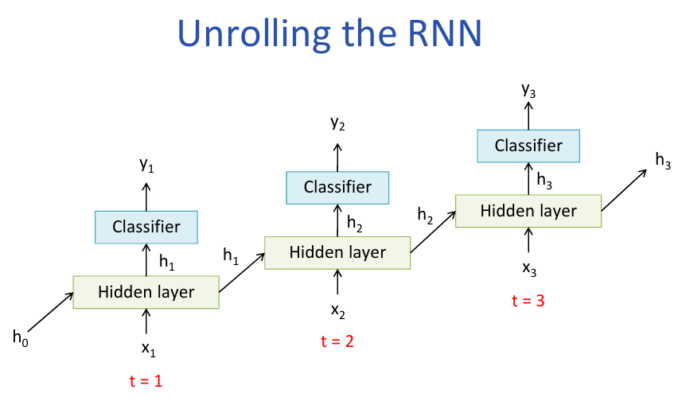

- **权重共享 (Shared weights)**：⭐ **核心特征**。在所有时间步中，权重矩阵 $W$ 是共享的，这与 MLP 不同。

  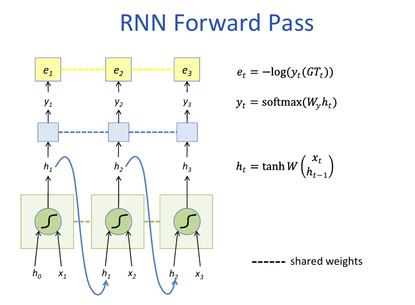

### 3. RNN 的训练：BPTT (Backpropagation Through Time)

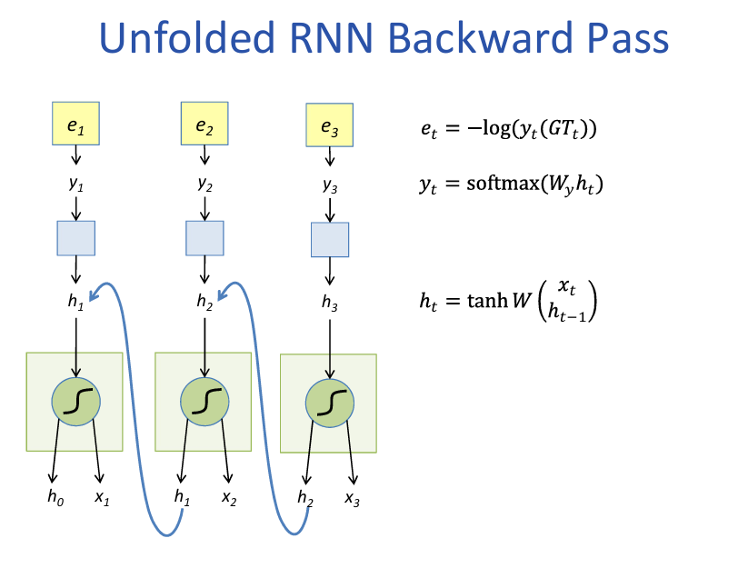

- **训练方法**：最常用的方法是 **随时间反向传播 (BPTT)**。

  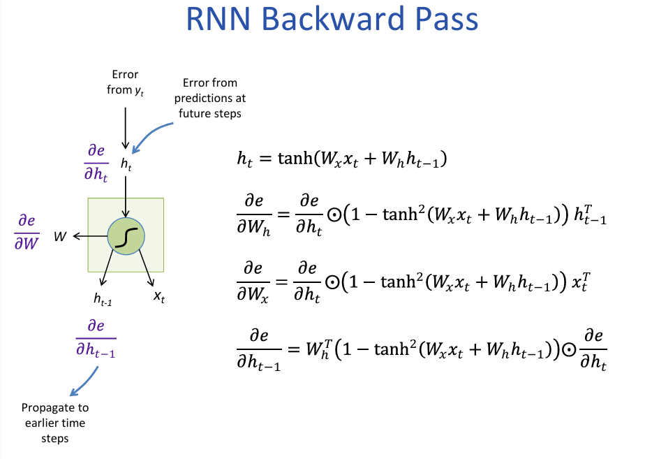

- **截断 BPTT (Truncated BPTT)**：在实践中，为了效率，通常只向前运行 $n$ 步，向后传播 $n$ 步。

### 4. 梯度消失与爆炸 (Vanishing/Exploding gradients)

- **问题根源**：长序列需要多个梯度相乘。如果 $W$ 的最大特征值小于 1，梯度会消失；如果大于 1，梯度会爆炸。

- ⭐ 解决方案：

  - **梯度裁剪 (Gradient clipping)**：通过缩放或裁剪梯度来轻松解决 **梯度爆炸** 问题。

  - **引入 LSTM**：由于梯度消失会导致网络无法捕捉 **长期依赖 (Long-term dependencies)**，因此需要使用门控机制。

    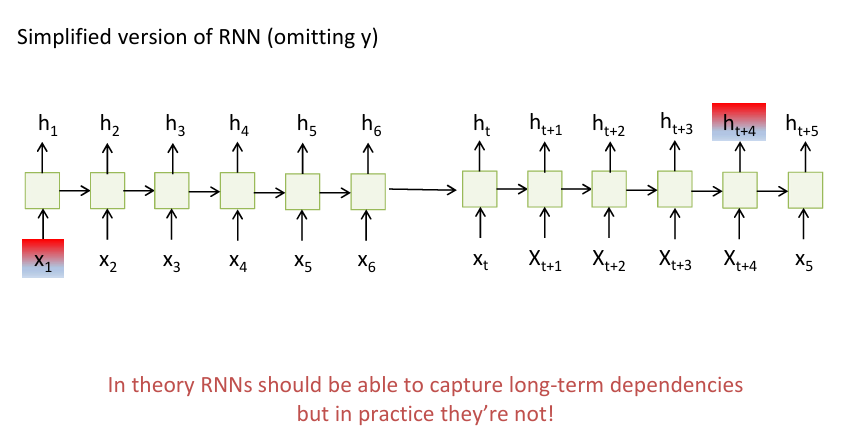

### 5. 长短期记忆网络 (LSTM)

- **核心理念**：增加一个 **记忆单元 (Memory cell, $c_t$)**。该单元不受矩阵乘法或挤压（squishing）激活函数的影响，从而避免梯度衰减。

  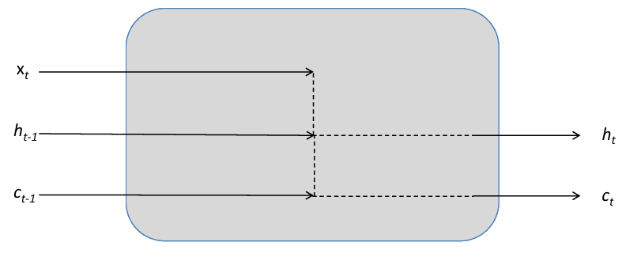

- ⭐ 三个门结构 (Three gates)：

  1. **输入门 (Input Gate, $i_t$)**：控制哪些新信息写入记忆。
  2. **遗忘门 (Forget Gate, $f_t$)**：控制哪些旧信息被擦除。
  3. **输出门 (Output Gate, $o_t$)**：控制哪些信息从记忆中读取到隐藏状态。

  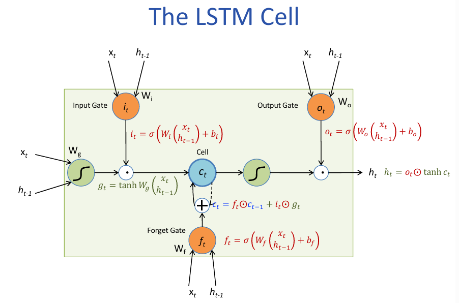

- **门控输入**：所有门的输入均包含 **当前输入 $x_t$** 和 **上一步的隐藏状态 $h_{t-1}$**。

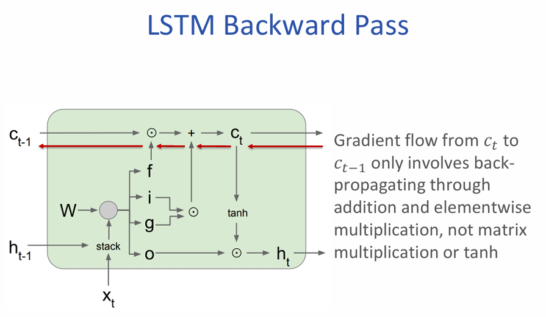

### 6. 应用场景 (Applications)

- 包括情感分类 (Sentiment classification)、语言模型 (Language Modeling)、机器翻译、图像标注等。

L8 的考点非常明确，尤其是 **RNN 权重共享的特性**、**BPTT 的原理** 以及 **LSTM 如何通过 Memory Cell 解决梯度消失**。

## L9

L9 课件分为两部分，第一部分补充了 **门控 RNN (Gated RNN)** 的变体，第二部分重点讲解了 **自编码器 (Autoencoders)** 与 **流形学习 (Manifold learning)**。

以下是按 PPT 顺序排列的考试要点：

### 1. 门控循环单元 (Gated Recurrent Unit, GRU)

- **结构简化**：舍弃了独立的单元状态 (Get rid of separate cell state)。
- **门控合并**：将“遗忘门”和“输出门”合并为 **更新门 (Update gate, $z_t$)**。
- 核心公式考点：
  - **重置门 (Reset Gate, $r_t$)**：控制前一时刻隐藏状态对当前候选状态的影响。
  - **更新门 (Update Gate, $z_t$)**：决定保留多少旧状态以及加入多少新状态。
- **最终状态计算**：$h_t = (1 - z_t) \odot h_{t-1} + z_t \odot h'_t$。

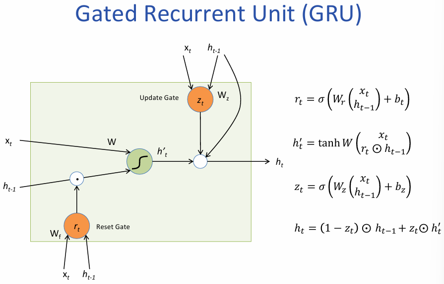

### 2. 双向 RNN (Bi-directional RNNs)

- **定义**：网络可以同时在前向 (Forward) 和反向 (Reverse) 方向处理输入序列。

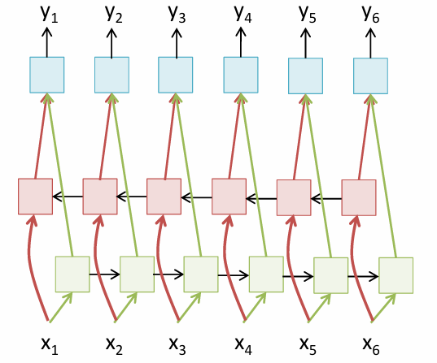

- **应用**：在语音识别 (Speech recognition) 中非常流行。

### 3. 主成分分析 (Principal Component Analysis, PCA)

- **目标**：寻找能够最大化投影数据方差的方向 (Maximize the variance of the projected data)。
- **核心计算**：最大化方差的方向是与协方差矩阵最大特征值 (Largest eigenvalue) 相关的特征向量 (Eigenvector)。
- **实现技巧 (Simple trick)**：当样本数远小于维度时，通过**求解 $XX^T$ 的特征向量来间接获取协方差矩阵的特征向量**，以节省计算成本。

### 4. 自编码器基础 (Autoencoders, AE)

- **定义**：一种通过训练将输入复制到输出的神经网络 (Neural networks trained to copy its input to its output)。

  

  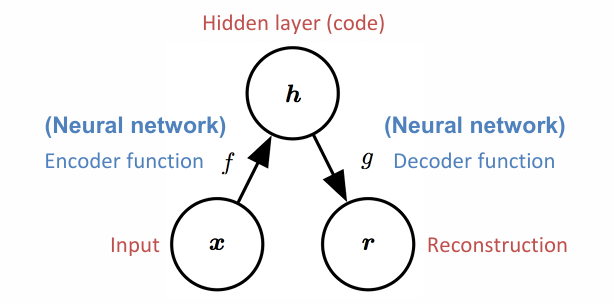

- **流形假设 (Manifold hypothesis)**：现实世界的数据通常集中在低维非线性区域。

- **结构**：包含 **编码器 (Encoder, $f$)** 和 **解码器 (Decoder, $g$)**，中间层为 **隐藏层/代码 (Hidden layer/code, $h$)**。

  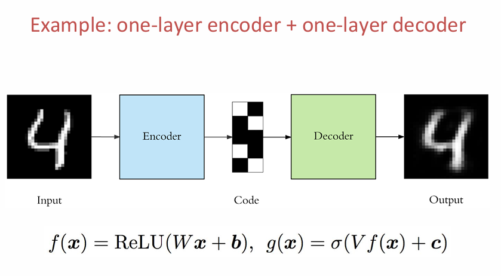

- ⭐**与 PCA 的关系**：当使用 **$L_2$ 范数且编码/解码函数均为线性**时，自编码器可以恢复 PCA 的结果。

### 5. 正则化自编码器 (Regularised Autoencoders)

这是本章最重要的分类考点，旨在通过限制容量防止网络学习到“恒等映射”等无用变换：

**2种结构**

- **欠完备自编码器 (Undercomplete)**：代码层维度小于输入维度。

  > If the encoder and decoder have high capacity we  can learn **trivial transformations**

- **过完备自编码器 (Overcomplete)**：$h$ 的维度大于 $x$，必须进行正则化 (Must be regularised)。

  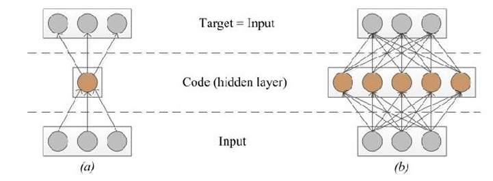

**⭐正则化自编码器的三种类型**

- **稀疏自编码器 (Sparse AE)**：在损失函数中加入惩罚项（如 $L_1$ 范数），惩罚过大的激活值。

  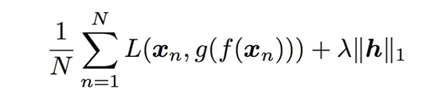

- **去噪自编码器 (Denoising AE)**：改变重构误差计算方式，使其能处理加入噪声（高斯噪声或 Dropout）后的输入，强制学习更鲁棒的特征。

  

  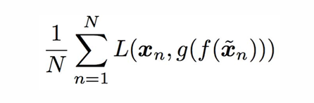

  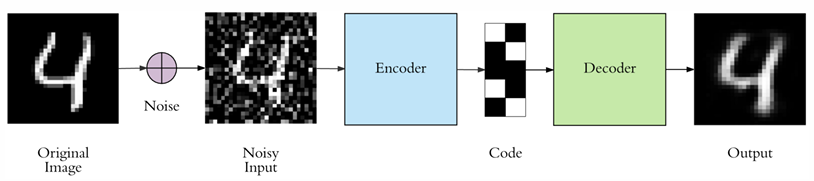

- **收缩自编码器 (Contractive AE)**：惩罚编码器雅可比矩阵的 Frobenius 范数 (Penalises Frobenius norm of the Jacobian)，使学习到的表示在训练样本周围变化较小。

### 6. 流形学习 (Manifold Learners)

- **原理**：自编码器通过重构压力 (Reconstruction) 和受限容量 (Limited capacity) 的共同作用，迫使隐藏表示捕捉数据生成分布的结构信息。
- **切向量 (Tangent vectors)**：自编码器能学习到捕捉流形局部坐标系的表示。

这一部分内容较多，尤其是 **正则化自编码器的三种类型** 经常在选择或简答题中出现。

## L10

根据 L10 课件及期末总结，本章的核心是**图像生成模型（Image Generation）**，主要围绕 **变分自编码器 (VAE)** 和 **生成对抗网络 (GAN)** 展开。

以下是按 PPT 顺序排列的考试要点：

### 1. 变分自编码器基础 (Variational Autoencoders, VAE)

- **生成动机 (Generation Motive)**：自编码器能否根据一个代码生成数据 (Can we use an autoencoder to generate data given a code?)。
- **潜空间探索 (Latent space exploration)**：与标准 AE 不同，VAE 的潜空间（Latent space）更加连续且有意义，允许进行插值（Interpolation），例如从“戴眼镜的脸”平滑过渡到“不戴眼镜的脸”。

### 2. VAE 架构与神经网络视角 (VAEs: neural networks perspective)

- **编码器 (Encoder, $q_\theta(z|x)$)**：输入数据 $x$，**输出隐藏表示 $z$ 的概率分布参数**，通常是**均值 $\mu$ 和方差 $\sigma$** (outputs mean and variance for $q_\theta(z|x)$)。

  > AE 是为了**压缩与提取特征**，而 VAE 是为了**生成新数据**
  >
  > * **AE (Standard Autoencoder)**：将输入映射为潜空间中的一个**固定点**
  > * **VAE (Variational Autoencoder)**：将输入映射为一个**概率分布**（通常是高斯分布）。Encoder 不直接输出代码 *z*，而是输出分布的参数：**均值** *μ* **和方差** *σ*

  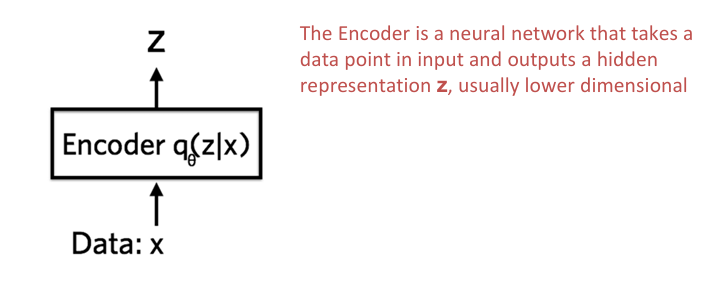

  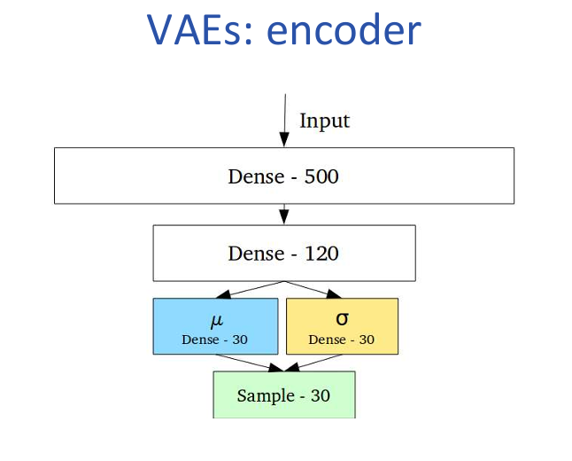

  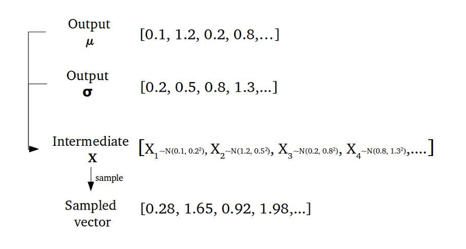

- **采样 (Sampling)**：由于编码器输出的是分布，我们需要从中采样得到一个特定的代码 $z$ (sample a representation/code $z$ from $q_\theta(z|x)$)。

  > **AE**：由于潜空间不是连续的，随机挑一个点传给 Decoder，可能只会得到一团乱码
  >
  > **VAE**：为了生成数据，VAE 会从 Encoder 输出的分布中**采样 (Sample)** 出一个 *z*，再交给 Decoder 重构。这使得潜空间变得“有意义 (meaningful)”，允许进行**插值 (Interpolation)**，比如实现从“戴眼镜的脸”到“没戴眼镜的脸”的平滑过渡

  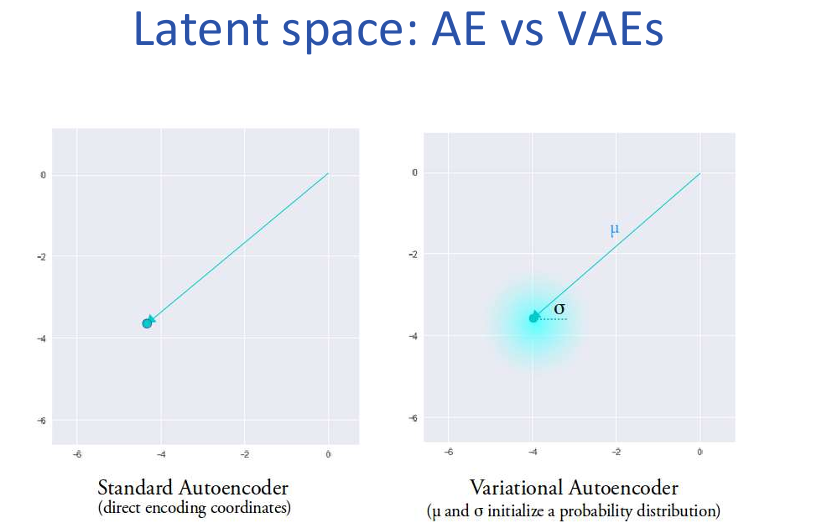

- **解码器 (Decoder, $p_\phi(x|z)$)**：输入采样得到的 $z$，输出重构数据 $\tilde{x}$ 的参数。对于二值图像，解码器输出 Bernoulli 参数。

  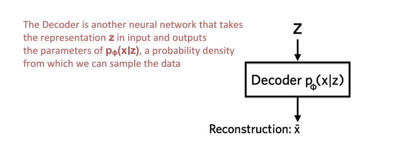

### 3. VAE 损失函数 (VAE Loss Function)

这是必考的理论理解点：

- 组成部分：总损失是两部分之和：
  $$
  l_i(\theta,\phi) = -E_{z\sim q_\theta(z|x_i)}[\text{log}p_\phi(x_i|z)]+KL(q_\theta(z|x_i)||p(z))\\
  \text{In VAEs we let } p(z)=Gaussian(0,1)\\
  $$

  * $-E_{z\sim q_\theta(z|x_i)}[\text{log}p_\phi(x_i|z)]$ encourages decoder to learn to reconstruct the data

  1. **重构对数似然 (Reconstruction log-likelihood, $\log p_\phi(x|z)$)**：衡量解码器重构 $x$ 的效果，失败则代价很大。

  2. **正则化项 (Regularisation term) - KL散度**：衡量编码得到的分布 $q$ 与先验分布 $p(z)$ 的接近程度，通常设 $p(z)$ 为标准高斯分布 $N(0,1)$。

     > * 为什么要正则化？
     >
     > 如果没有正则化项，Encoder 会通过给每个输入分配空间中极小且互不相连的区域来“作弊”，导致潜空间出现大量空隙。加入 KL 散度约束是为了确保潜空间是**连续且平滑的**，从而让模型具备生成能力
     >
     > **AE 学的是“点”，VAE 学的是“分布”并引入了 KL 散度作为正则化**
     >
     > 

- **作用**：正则化项防止编码器“作弊”为每个输入分配极小区域的单一代码，从而确保潜空间是有意义的 (space has to be “meaningful”)。

### 4. 概率视角与变分推理 (VAEs: probabilistic perspective)

- **推断 (Inference)**：目标是最大化 $p(x)$。
- **难点 (Intractable)**：直接计算后验分布 $p(z|x)$ 需要指数级时间，是不可行的 (intractable)。
- **变分推理 (Variational Inference)**：通过一个分布族 $q_\lambda(z|x)$ 来近似真实后验分布。
- **ELBO (Evidence Lower Bound)**：公式推断不考，但要理解**最大化 ELBO 等价于最小化 $q$ 与真实后验之间的 KL 散度**，同时提高生成器质量。

## L11

根据课件 L11 和期末复习总结，**生成对抗网络 (Generative Adversarial Networks, GAN)** 是考试的==重中之重==，尤其是其训练步骤和损失函数。

以下是按 PPT 顺序梳理的考试要点：

### 1. 生成任务分类 (Generative Tasks)

- **无条件生成 (Unconditional generation)**：从随机噪声或潜码（Random seed or latent code）中学习采样，使模型分布 $p_{model}$ 匹配真实数据分布 $p_{data}$。
- **条件生成 (Conditional generation)**：根据标签或侧面信息生成特定样本。

### 2. GAN 的核心架构 (Core Components)

GAN 由两个对立的目标网络组成：

- **生成器 (Generator, $G$)**：输入随机噪声 $z$，学习生成样本以“骗过”判别器。

- **判别器 (Discriminator, $D$)**：输入真实或虚假样本 $x$，估计其为真实样本的概率 $D(x)$。

- **博弈过程**：$G$ 试图欺骗 $D$，$D$ 试图变得更擅长区分真假。两者通常都由深度神经网络实现，以便使用反向传播。

  

### 3. ⭐ 损失函数与博弈目标 (Loss Function & Minimax Game)

这是考试中可能要求手写的公式： $$\min_{G} \max_{D} V(D, G) = \mathbb{E}_{x \sim p_{data(x)}}[\log D(x)] + \mathbb{E}_{z \sim p_z(z)}[\log(1 - D(G(z)))]$$

> * $x$为真图 $z$为生成器生成的假图
>
> * 下标$x \sim p_{data(x)}$描述了数据的来源及其概率分布
>
>   * *x*：代表**真实样本**（Real sample），例如训练集中的一张真实图片。
>
>   * ∼：数学符号，意为“**采样自...**”（Sampled from）。
>
>   * $p_{data(x)}$：指代**真实数据分布**（True data distribution），即训练数据所服从的原始分布。

- **判别器 $D$ 的目标**：最大化 (Maximise) 该公式，即让 $D(x)$ 接近 1（识别真图），让 $D(G(z))$ 接近 0（识别假图）。
- **生成器 $G$ 的目标**：最小化 (Minimise) 该公式，即让 $D(G(z))$ 接近 1，从而误导判别器。
- **收敛状态**：达到 **纳什均衡 (Nash equilibrium)**，此时 $D(x) = 1/2$，判别器无法区分真假分布。

### 4. ⭐ 训练步骤 (Training Steps: Step-by-Step)

老师在录音中强调，必须说明这是 **交替训练 (Alternative Training)**，不可同时训练：

1. **固定生成器，更新判别器**：对 $D$ 进行 **梯度上升 (Gradient ascent)**，以最大化正确分类真实和虚假样本的概率。
2. **固定判别器，更新生成器**：对 $G$ 进行梯度下降。
3. **实践中的修正 (Modified Loss)**：由于训练初期 $D$ 很容易拒绝生成的样本导致梯度消失，实践中常用 **最大化 $\log D(G(z))$** 来代替最小化 $\log(1 - D(G(z)))$。

### 5. 现实中的问题 (Problems in the Real World)

* **样本数量有限** : training set is finite, not the  full distribution
* **Limited capacity**: the generator has limit  capacity, i.e. cannot perfectly represent any  distribution

- **收敛困难**：寻找高维非凸博弈的纳什均衡仍是开放性难题。
- **鞍点问题 (Saddle point problem)**：比单纯寻找极大/极小值更难。
- **平衡更新 (Balancing updates)**：如果 $D$ 太强或太弱，都会导致 $G$ 无法获得改进的梯度。

### 6. 条件生成网络 (Conditional GAN, cGAN)

- **原理**：将离散信息（如标签 $y$）或连续信息加入 $G$ 和 $D$ 中。
- **应用**：例如文本生成图像 (Text-to-image synthesis)、风格迁移 (Style transfer) 以及图像翻译 (Image-to-image translation)。

### 7. 考点补充：判别器的用途

- **训练后的功能**：老师提到，训练完成后，判别器可用于检测样本是否符合物理真实性，或区分特定类别（如区分人脸与非人脸）。

## L12

根据课件 L12 和期末总结录音，**对抗样本 (Adversarial Examples)** 章节是考试中关于模型安全性的核心考点，重点在于“如何攻击”与“如何防御”。

以下是按 PPT 知识点出现顺序梳理的考试要点：

### 1. 对抗样本的基本定义 (Definition)

- **对抗样本 (Adversarial examples)**：通过对输入图像进行微小的、人眼不可察觉的扰动（Imperceptibly perturbing），使得神经网络将其错误分类。

  

- **生成偏好输入 (Generating preferred inputs)**：可以使用梯度上升 (Gradient ascent) 来生成看起来很奇怪但能最大化特定单元激活值的图像。这证明了神经网络很容易被感官上毫无意义的图像以高置信度误导。

### 2. 寻找最小扰动 (Finding the smallest adversarial perturbation)

* Start with correctly classified image $x$
* Find perturbation $𝑟$ minimizing $||r||_2$

>  **优化目标**：在保持 $x+r$ 在合法像素范围内且被误分类的前提下，寻找使扰动 $r$ 的 $L_2$ 范数最小化的解，确保生成的对抗样本 x+r 在视觉上与原始图像 x 极其相似

- **实现方法**：这是一个受约束的非凸优化问题，可以通过 **L-BFGS** 算法解决。

### 3. 梯度上升法 (Gradient ascent)

相比寻找绝对最小扰动，更简单的方法是沿着梯度方向走一小步：

- **降低正确类得分**：$x \leftarrow x + \eta \frac{\partial L(x, y^*)}{\partial x}$，其中 $L$ 是损失函数，$y^*$ 是正确类别。
- **增加错误目标类得分**：$x \leftarrow x - \eta \frac{\partial L(x, \hat{y})}{\partial x}$，其中 $\hat{y}$ 是目标错误类别。

### 4. 线性情况分析 (Analysis of the linear case)

这是解释对抗样本产生原因的关键点：

- **核心逻辑**：对于线性分类器 $f = w^T x$，对抗样本的响应为 $w^T(x + r) = w^T x + w^T r$。
- **最优扰动**：为了在约束 $|r|_\infty \le \epsilon$ 下最大化激活值增量，选择 $r = \epsilon \text{ sign}(w)$。
- **高维优势**：如果 $w$ 是 $d$ 维且平均元素大小为 $m$，则激活值增加量为 $\epsilon d m$。这说明**维度 $d$ 越高，越容易通过微小改变产生巨大的输出变化**。

### 5. ⭐具体攻击方法 (Generating adversarial examples)

老师在录音中明确要求掌握这三种方法及其区别：

- **快速梯度符号法 (Fast Gradient Sign Method, FGSM)**：计算损失函数对输入的梯度，取其符号并乘以 $\epsilon$ 进行更新：$x \leftarrow x + \epsilon \text{ sign}(\nabla_x L(x, y^*))$。
- **迭代梯度符号法 (Iterative gradient sign method)**：采取多个小步并进行剪切 (Clip)，确保结果处于原始图像的 $\epsilon$ 邻域内。
- **最不相关类方法 (Least likely class method)**：尝试将图像误分类为初始得分最低的类别 $\hat{y}$：$x \leftarrow x - \epsilon \text{ sign}(\nabla_x L(x, \hat{y}))$。

### 6. 通用对抗扰动 (Universal adversarial perturbations)

- **目标**：寻找一个与图像无关的扰动向量 $r$，使得该网络对所有图像的分类概率都显著下降。
- **特性**：这种通用扰动在不同模型架构（如从 VGG 迁移到 ResNet）之间具有良好的**泛化性 (Generalize well)**。

### 7. 黑盒攻击 (Black-box adversarial examples)

- **原理**：攻击者无法获取目标网络参数，只能观察输出。通过合成数据训练一个**替代网络 (Substitute network)**，然后在替代网络上制作对抗样本来攻击目标网络。

### 8. 对抗样本的属性与成因 (Properties & Why)

- **属性**：对抗样本通常具有**迁移性 (Transferability)**，即能欺骗具有不同参数甚至不同架构的网络。它们有时还能在打印并拍照后依然生效。
- 成因：
  1. **网络“太线性”**：在高维空间中，输出随输入改变的可预测性太强。
  2. **高维度**：输入维度极高，微小改变的累积效应巨大。

### 9. 防御策略 (Defending against adversarial examples)

⭐这是简答题常考点：

- **对抗训练 (Adversarial training/Robust training)**：将对抗样本加入训练集进行数据增强（Data Augmentation）或正则化。
- **对抗检测器 (Learning to reject/Adversarial detectors)**：训练一个单独的模型（如 SafetyNet）来检测并拒绝对抗样本。
- **鲁棒架构 (Robust architectures)**：设计高度非线性的架构以抵御扰动。
- **图像预处理 (Image pre-processing)**：在输入网络前对图像进行裁剪、压缩或位深缩减，以破坏潜在的扰动。

**考试提醒**：本章可能会考如何描述特定的攻击算法（如 FGSM），或让你列举并解释几种不同的防御手段

## L13

根据 L13 课件和期末复习录音，**图卷积网络 (Graph Convolutional Networks, GCN)** 的核心考点在于处理非欧几里得数据的动机、图的数学表示以及 GCN 的层级设计。

以下是按 PPT 顺序排列的考试要点：

### 1. 特征与结构 (Features vs Structure)

- **核心逻辑**：传统模型将物体看作**提取特征的集合** (Object as set of extracted features)，但 GCN 将其看作**相互关联的组件** (Object as components in relation with each other)。

### 2. 图的数学定义 (Graphs Definition)

- **组成部分**：一个图由**顶点集合 $V$** (Set of vertices) 和**边集合 $E$** (Set of edges) 组成。

- **属性**：顶点可以有标签 (Labelled)；边可以是有向的 (Directed) 或有权重的 (Weighted)。

- 矩阵表示 (Matrices)：

  - **邻接矩阵 (Adjacency matrix, $A$)**：描述节点间的连接关系。

  - **度矩阵 (Degree matrix, $D$)**：对角矩阵，表示每个节点的连接数。

  - **拉普拉斯矩阵 (Laplacian matrix, $L = D - A$)**。

    

### 3. 图学习的任务类型 (Tasks in Learning on Graphs)

- **图分类 (Graph classification)**：为整个图分配一个标签，如判断化学分子是否有毒。
- **节点分类 (Node classification)**：预测图中部分缺失标签节点的属性。
- **链路预测 (Link prediction)**：预测图中缺失的边。

### 4. ⭐ 动机与挑战 (Motivations & Challenges)

- **动机**：深度学习算法通常在向量空间工作，但将图转化为向量（嵌入）非常困难。

  > ML/DL algorithms work on vectorial spaces

- 挑战：

  1. **节点顺序**：改变节点顺序不应改变其在嵌入空间的位置。
  2. **不规则网格 (Irregular grid)**：图的形状不固定且大小不一。

### 5. ⭐ GCN 架构设计 (Design of GCN)


- **基本输入**：节点特征矩阵 $X$ 和邻接矩阵 $A$。

  - $X$ **(节点特征矩阵)**：代表了每个节点自身的属性（如用户的年龄、职业或分子的原子类型）
  - $A$ **(邻接矩阵)**：代表了节点之间的**关系或结构**。GCN 的核心是将物体视为“相互关联的组件”，而不仅仅是孤立特征的集合

- **简单传播公式 (Simple example)**：$H^{(l+1)} = \text{ReLU}(A H^{(l)} W^{(l)})$。

- **公式推导**

  - $H^{(l+1)}=f(H^{l},A)$  

    - **$H^{(0)}$ ** is the feature matrix $X$
    - **$H^{(l)}$ ** is the output matrix $Z$ (the last layer) 
    - Different GCN models vary in the choice and parametrisation of f

  - A simple network could be defined as $H^{(l+1)}=ReLU(AH^{(l)}W^{(l)})$

    - $W^{(l)}$ is parameters of l-th layer
    - $AH^{(l)}$ for **l=0** that’s a multiplication between the **adjacency matrix** and the **node-feature matrix**
    - Multiplying $A$ and $H$ computes a new feature for the **node i** which is the sum of all the features of its neighbours

  - **存在的问题及改进措施**

    - **忽略自信息**：The feature at node i is NOT included in the computation  of the new aggregated feature at node i.

      > 1. **邻接矩阵的缺陷**：在标准的邻接矩阵 *A* 中，对角线上的元素通常为 0（即 $A_{ii}$​=0），这意味着节点与自己之间没有连接。
      > 2. **计算结果**：当你计算 *A*×*H*（矩阵乘法）时，节点 *i* 的新特征实际上是其所有**邻居特征的加权总和**。因为 $A_{ii}$=0，节点 *i* 自身的特征在求和过程中被乘号“抹除”了。
      > 3. **后果**：如果不包含节点自身的特征，模型在每一层迭代时都会丢失节点原有的身份信息，导致特征提取不完整。
      > 4. **解决方案 (Self-loop)**：为了修复这个问题，我们在设计 GCN 时会给每个节点增加一个“**自环 (Self-loop)**”。数学上表现为将邻接矩阵修改为 *A*^=*A*+*I*（*I* 是单位矩阵），这样对角线就变成了 1，确保节点 *i* 的特征也能参与到下一层的计算中。

    - **梯度问题**: node with large degrees might have large representations, and  vice versa. This might cause explosion or vanishing problem. 

      > **Normalise A** so the scale of the feature vectors doesn’t change

    - 归一化后的公式为$H^{(l+1)} = \text{ReLU}(\hat{D}^{-1} \hat{A} H^{(l)} W^{(l)})$

      > $\hat{D}$  是一个对角矩阵（Diagonal matrix），它**只在对角线上有值**，记录的是每个节点的度数。它的逆矩阵 $D^{−1}$ 仅仅起到“除以度数”的作用，用来对聚合后的特征进行平均化（Normalise），防止特征值随层数增加而爆炸
      >
      > **平均化逻辑**：当 $D^{−1}$ 与 $A^H$ 相乘时，相当于把节点 *i* 聚合到的邻居特征总和除以它的度数 $D^{ii}$。这确保了特征的量级（Scale）不会因为邻居太多而爆炸，从而解决了 **梯度爆炸或消失（Explosion or vanishing problem）** 的隐患

- **最终标准公式**：$H^{(l+1)} = \text{ReLU}(\hat{D}^{-1/2} \hat{A} \hat{D}^{-1/2} H^{(l)} W^{(l)})$。

### 6. 应用与扩展 (Applications)

- **节点预测**：在最后加入 Softmax 层并配合交叉熵损失函数。
- **全图分类**：通过类似池化 (Pooling-like approach) 的方法将节点级特征合并为单张图的特征。

**考试提醒**：老师在录音中提到，可能会给出一个具体的图结构，要求你写出其对应的**邻接矩阵 $A$**、**度矩阵 $D$** 并描述如何设计一层 GCN。

### 7. 可能考的例题-GCN 层设计

根据录音和课件 L13 的内容，这里为你准备了一个典型的考试练习题。

**题目：** 给定一个包含 3 个节点的无向图，连接关系为：1-2，2-3。

1. 写出该图的邻接矩阵 $A$。
2. 写出添加自环（Self-loop）后的矩阵 $\hat{A}$ 及对应的度矩阵 $\hat{D}$。
3. 描述如何设计一层 GCN。

**解题步骤：**

**第一步：写出原始邻接矩阵 $A$**

根据连接关系（1-2, 2-3），节点 1 连 2，节点 2 连 1 和 3，节点 3 连 2： $$A = \begin{bmatrix} 0 & 1 & 0 \\ 1 & 0 & 1 \\ 0 & 1 & 0 \end{bmatrix}$$

**第二步：添加自环得到 $\hat{A}$**

自环即 $\hat{A} = A + I$，让对角线全变为 1，确保计算时包含节点自身特征： $$\hat{A} = \begin{bmatrix} 1 & 1 & 0 \\ 1 & 1 & 1 \\ 0 & 1 & 1 \end{bmatrix}$$

**第三步：写出度矩阵 $\hat{D}$**

$\hat{D}$ 是对角矩阵，$\hat{D}_{ii}$ 等于 $\hat{A}$ 中第 $i$ 行的元素之和（即含自环的度数）：

- 节点 1 的度为 2（连 2 + 自己）
- 节点 2 的度为 3（连 1, 3 + 自己）
- 节点 3 的度为 2（连 2 + 自己） $$\hat{D} = \begin{bmatrix} 2 & 0 & 0 \\ 0 & 3 & 0 \\ 0 & 0 & 2 \end{bmatrix}$$

**第四步：设计 GCN 层**

使用对称归一化公式来定义这一层： $$H^{(l+1)} = \text{ReLU}(\hat{D}^{-1/2} \hat{A} \hat{D}^{-1/2} H^{(l)} W^{(l)})$$

- **输入**：节点特征矩阵 $H^{(l)}$ 和上述计算出的 $\hat{A}, \hat{D}$。
- **参数**：需要训练的权重矩阵 $W^{(l)}$。
- **激活函数**：通常使用 ReLU。

## L14

根据 L14 课件（Attention and Transformers）及期末复习要点，以下是按 PPT 顺序整理的核心考点：

### 1. 从 RNN 到 Attention 的动机 (From RNN to Attention)

- **瓶颈问题 (The Bottleneck Problem)**：在标准的序列到序列（Seq2Seq）模型中，整个输入序列被压缩进一个固定大小的向量（Fixed-sized vector）中。如果序列极长（如 T=1000），这个向量会成为信息传输的瓶颈。
- **目标 (Goal)**：在解码时能够引用输入的信息（Reference the inputs as we decode）。

### 2. 注意力机制的计算步奏 (Attention Computation)

- **计算对齐分数 (Compute alignment scores, $e_{t,i}$)**：使用线性层或点积计算解码器状态与编码器隐藏状态之间的相关性。


- **归一化得到权重 (Normalize alignment scores to get attention weights, $a_{t,i}$)**：通过 **Softmax** 函数将分数转化为 0 到 1 之间的概率，且总和为 1。


- **计算上下文向量 (Compute context vector, $c_t$)**：将隐藏状态按注意力权重进行加权求和（Weighted sum of hidden states）。


- **直觉 (Intuition)**：上下文向量会“注视”（Attends to）输入序列中相关的部分。


### 3. Image Captioning with RNNsand Attention


> A general and useful tool! Calculating vectors that are learned,  weighted averages over inputs and  features

### 4. 通用注意力层 (General Attention Layer)

* **发展**
  * 
  * 
  * 
  * 
  * 
  * 
  * 
  * 
  * 
  * 
  * 

- **输入元素 (Inputs)**：包括 **查询向量 (Query, $h$)** 和 **特征向量 (Features/Keys, $z$)**。
- 缩放点积注意力 (Scaled Dot-Product Attention)：
  - **动机**：维度 $D$ 较大时，点积结果的方差会变大，导致 Softmax 变得尖锐（Peak）并产生极小的梯度。
  - **解决方法**：除以 **$\sqrt{D}$** 来减小大数值向量的影响。

### 5. 自注意力层 (Self-Attention Layer)


- **定义**：直接从输入向量中计算 **查询 (Query, $q$)**、**键 (Key, $k$)** 和 **值 (Value, $v$)**。
- **排列无关性 (Permutation Invariant/Equivariant)**：自注意力层不关心输入的顺序。如果改变输入顺序，输出也会相应改变顺序，但内容逻辑不变。

### 5. Transformer 核心组件 (Transformer Components)

- 位置编码 (Positional Encoding)：

  - **必要性**：由于注意力机制是排列无关的，模型无法分辨单词顺序（如 "I eat apple" vs "Apple eat me"）。

    

  - **实现**：向输入中添加基于 **正弦和余弦 (Sines and cosines)** 的位置函数。

    

    

    

    

- 掩码自注意力 (Masked Self-Attention)：

  

  - **目的**：在解码时防止向量“看到”未来的向量（Prevent looking at future vectors）。
  - **实现**：手动将未来位置的对齐分数设为负无穷（$-\infty$）。

- **多头注意力 (Multi-head Attention)**：并行运行多个自注意力“头”，类似于 CNN 中使用多个卷积核来捕捉不同的特征信息。

  

  

### 6. Transformer vs. RNN 对比 (Comparing RNNs to Transformer)

- **RNN**：擅长处理长序列，但必须按顺序计算（Sequential computation），无法并行化。
- Transformer：
  - **优点**：支持 **并行计算 (Parallel computation)**，每个注意力计算都能直接看到所有输入，非常适合长序列。
  - **缺点**：消耗大量内存（计算 $N \times M$ 的对齐矩阵）。

**考试提醒**：开放题可能会要求你描述 **如何计算注意力权重**，或者解释 **为什么 Transformer 需要位置编码 (Positional Encoding)**。